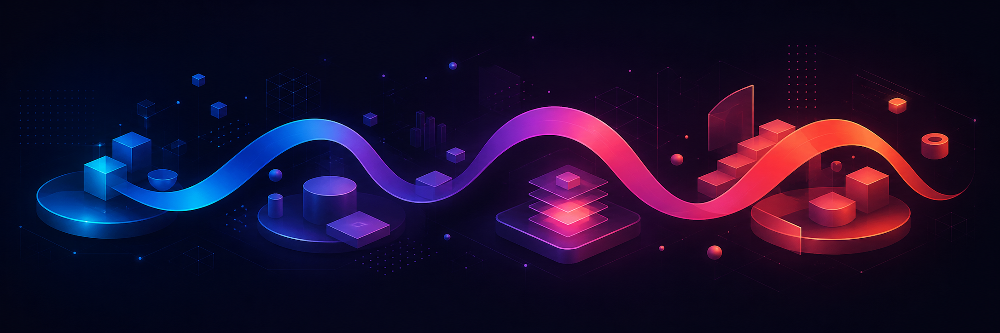

<p align="center">
  
</p>

<h1 align="center">W-Gain</h1>

<p align="center">
  <strong>Build. Ship. Learn. Compound.</strong><br>
  작은 아이디어를 실제로 만들고 운영하며, 그 경험을 다음 프로젝트의 기반으로 쌓아갑니다.
</p>

## About

W-Gain은 하나의 서비스나 기술에 한정되지 않는 **개인 사이드 프로젝트 조직**입니다. 웹 제품과 API, 인프라와 자동화, 개발 도구와 실험적인 아이디어까지 직접 만들고 배포하며 운영합니다.

저장소를 단순히 모으는 데서 그치지 않고, 프로젝트마다 얻은 코드·운영 경험·자동화 방식을 재사용 가능한 자산으로 축적하는 것을 목표로 합니다.

## What we build

- 사람에게 실제로 유용한 제품과 서비스
- 제품을 지탱하는 API, 플랫폼, 인프라
- 반복 작업을 줄이는 자동화와 개발 도구
- 빠르게 검증하고 배울 수 있는 기술 실험

프로젝트의 목적과 현재 상태, 실행 방법은 각 저장소의 README에서 관리합니다. 이 프로필은 프로젝트 목록보다 W-Gain 전체의 방향과 공통 원칙을 설명합니다.

## How we work

```text
Idea → Build → Review → Ship → Operate → Learn
```

- **끝까지 운영합니다.** 구현뿐 아니라 배포, 관찰, 개선까지 프로젝트의 일부로 봅니다.
- **작게 시작하고 축적합니다.** 한 프로젝트에서 얻은 기반과 경험을 다음 작업에 재사용합니다.
- **자동화하되 책임은 분명히 합니다.** AI 에이전트는 조사·구현·테스트·문서화를 돕고, 방향과 최종 책임은 사람이 맡습니다.
- **검증 가능한 변경을 만듭니다.** 작업은 Issue와 Pull Request로 추적하고, 자동 검사와 리뷰를 거쳐 배포합니다.

## Explore

현재 진행 중인 작업은 [W-Gain repositories](https://github.com/orgs/W-Gain/repositories)에서 확인할 수 있습니다. 버그 제보와 기능 제안은 해당 프로젝트의 Issue를 이용해 주세요. 보안 문제는 공개 Issue 대신 각 저장소의 Security 안내를 따라 주세요.
